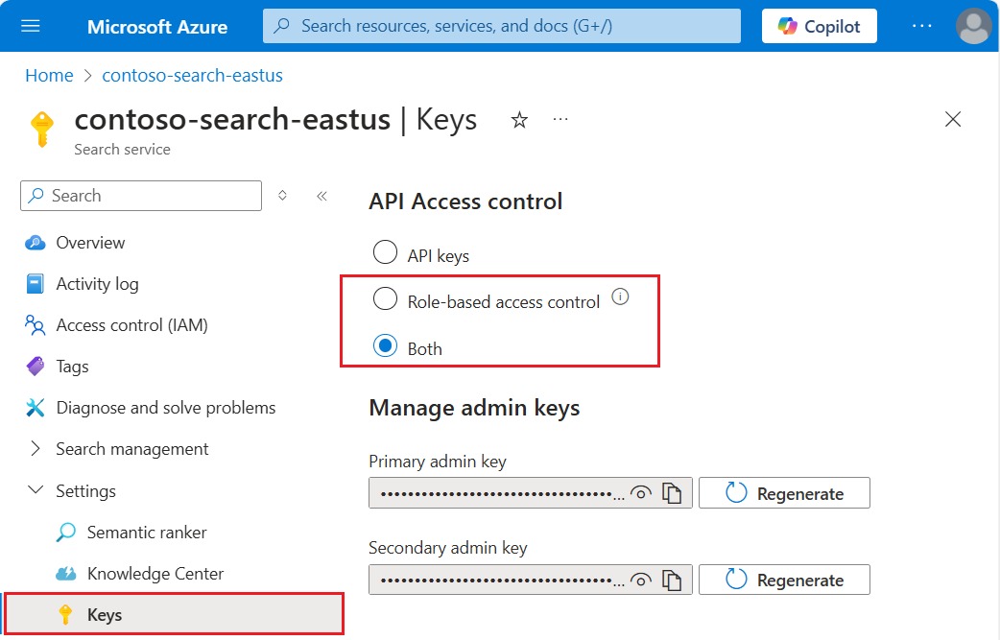
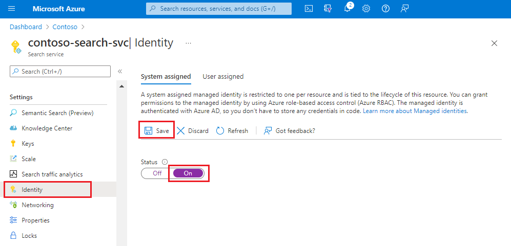
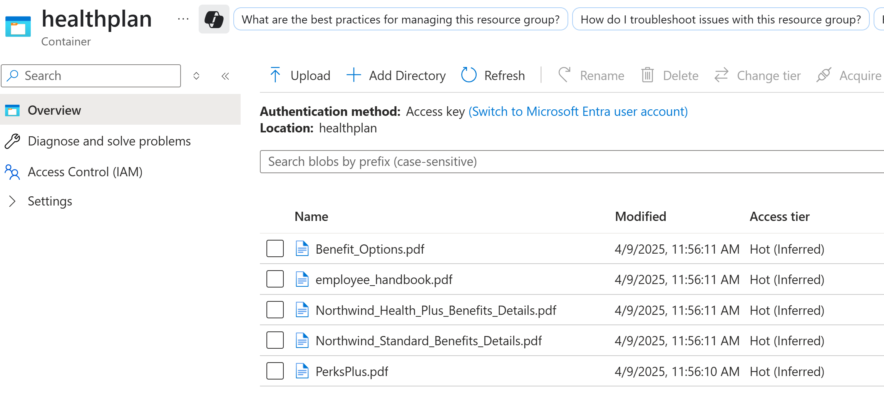
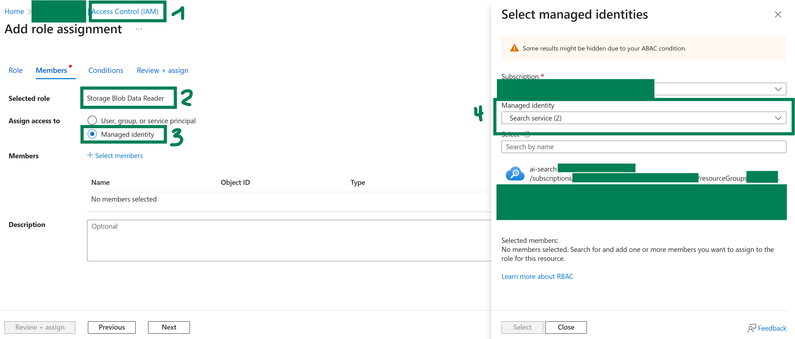

# Azure Resource Setup
To ensure a smooth training experience, pre-deploy the Azure resources as described below with the recommended configurations.

## Disclaimer
- For the purposes of this training, all of the preceding resources must have public access enabled.
- You can use key authentication and full access connection strings, or Microsoft Entra ID with role assignments. We recommend role assignments for search service connections to other resources. Below are instructions how to setup role assignments for search service connections. However, there is the alternative option to also revert to key authentication for this training. Then the **Access Control** steps below can be skipped, and instead the **Access Keys** or **Connection Strings** have to be shared with the training participants

## Deploy Azure Resources
1. (Optional): Deploy a dedicated resource group for this repository
2. Deploy an Azure OpenAI service. It can be deployed as a stand-alone service, or using Azure AI Foundry.
3. Deploy an Azure Storage Account (ADLS Gen2) with hierarchical namespace enabled
4. Deploy and Azure AI Search Service (if no networking requirements exist, you can choose "Basic" tier, else "Standard" Tier S1)

### A few remarks on the choice of deployment region
Due to feature availability, it is recommended to deploy Azure OpenAI and Azure AI Search in the region "Sweden-Central".
* To use all advanced AI search features, **North Europe** would be recommended (see [here](https://learn.microsoft.com/en-us/azure/search/search-region-support#europe) feature availability for Europe).
* However, for Fine-Tuning OpenAI model, **Sweden Central** and **Switzerland West** are only available in Europe (see [here](https://learn.microsoft.com/en-us/azure/search/search-region-support#europe)). Switzerland has only access to older models, while Sweden Central also allows for fine-tuning of gpt-4o and gpt-4o-mini
* Therefore, **Sweden Central** is recommended as a region

## Roll out permissions for users
- If deployed in a dedicated resource group, deploy the following permissions for the participants of the workshop on the scope of the resource group
- Else, roll the permissions out individually on the resources
    1. Contributor (all resources)
    2. Search Service Contributor (AI Search service)
    3. Storage Blob Data Contributor (Azure Storage Account)

## Configure Resources
### Azure AI Search
- Set the API access control to "Both". More info here on [Enable roles](https://learn.microsoft.com/en-us/azure/search/search-security-enable-roles?tabs=config-svc-portal%2Cdisable-keys-portal)

- Configure the search service to use a [managed identity](https://learn.microsoft.com/en-us/azure/search/search-howto-managed-identities-data-sources?tabs=portal-sys%2Cportal-user#create-a-system-managed-identity)

Note: A free search service supports role-based connections to Azure AI Search, but it doesn't support managed identities on outbound connections to Azure Storage or Azure AI Vision. This level of support means you must use key-based authentication on connections between a free search service and other Azure services.

### Azure Storage Account
- Go to your Azure Storage Account and create a new container (e.g. healthplan)
- Upload the [Health Plan PDF documents](https://github.com/Azure-Samples/azure-search-sample-data/tree/main/health-plan) to this container

- Go to **Access Control** and assign the **Storage Blob Data Reader** role to the search service identity

### Azure OpenAI
- Go to **Access Control** and assign the **Cognitive Services OpenAI User** role to the search service identity
- Launch Azure AI Foundry portal
- Go to the Deployments tab
- Deploy an Azure OpenAI chat completion model (e.g. gpt-4o)
- Deploy an Azure OpenAI embedding model (e.g. text-embedding-ada-002)

