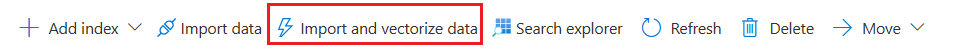
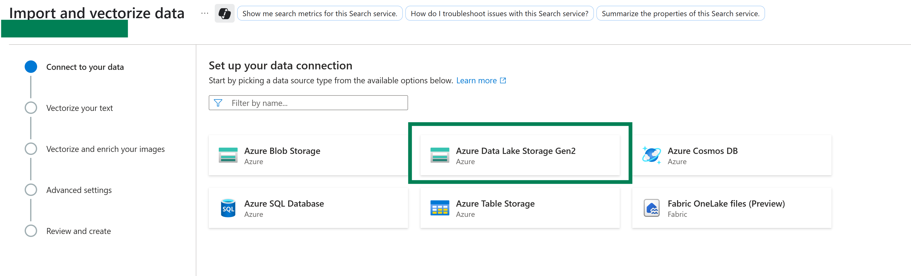
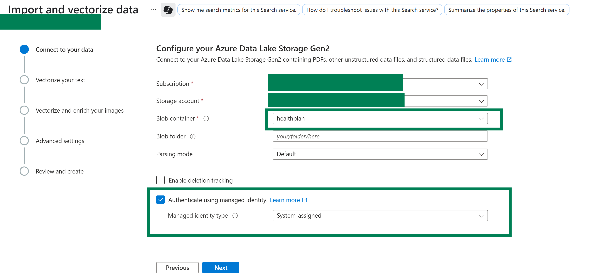
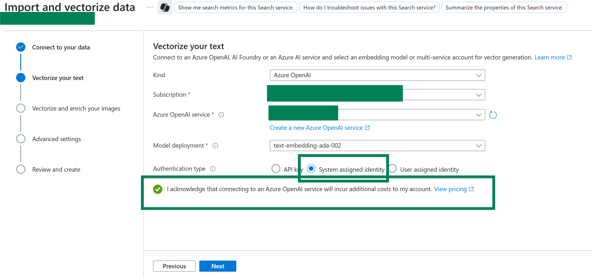
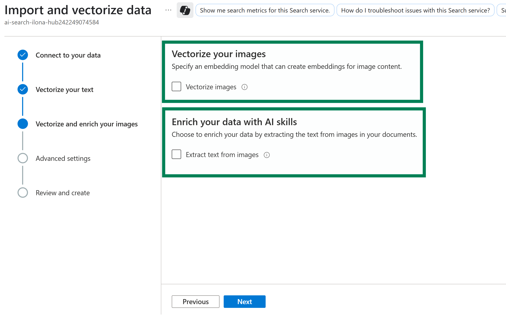
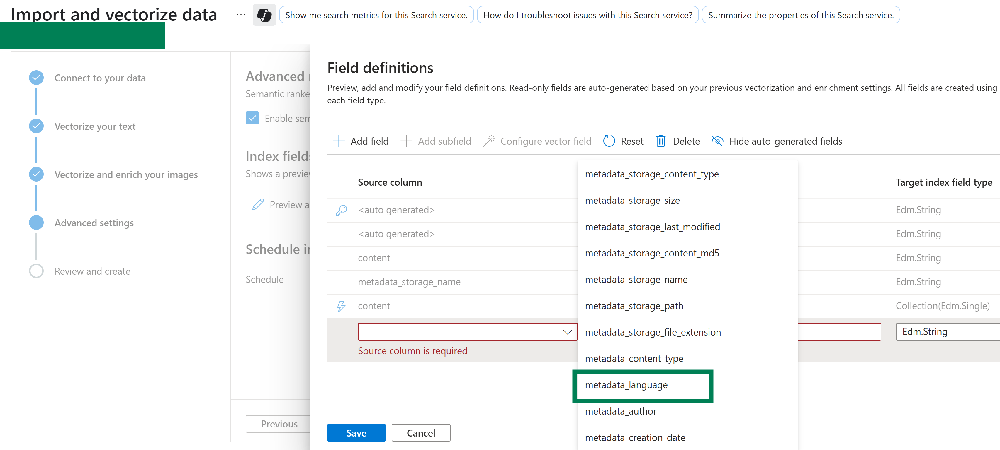
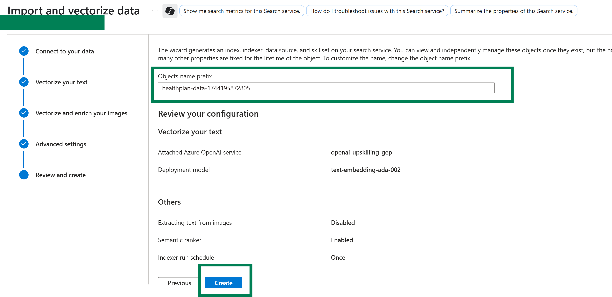
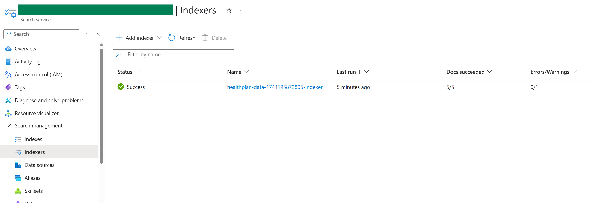
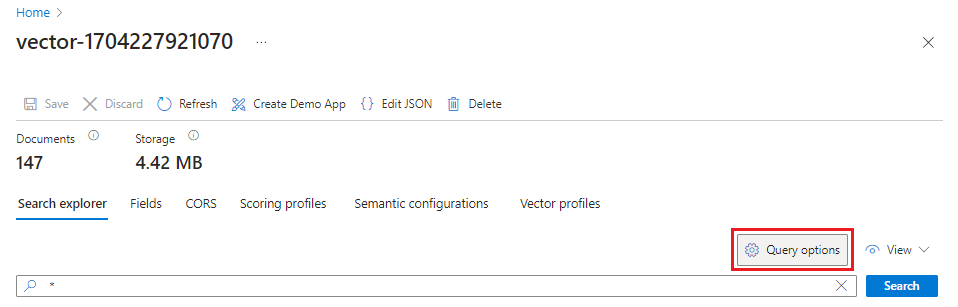
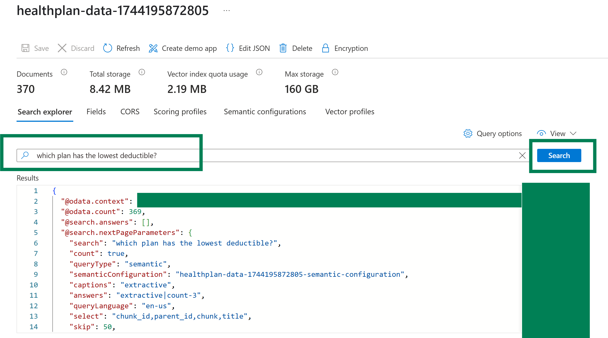

# Quickstart Experience to Setup your first Index
In this quickstart, you use the Import and vectorize data wizard in the Azure portal to get started with integrated vectorization. The wizard chunks your content and calls an embedding model to vectorize content during indexing and for queries.

## Setup
- This quickstart is based on the ([Vector Search wizard](https://learn.microsoft.com/en-us/azure/search/search-get-started-portal-import-vectors?tabs=sample-data-adlsgen2%2Cmodel-aoai%2Cconnect-data-adlsgen2))
- However, for a smooth training experience, a few steps have already been completed beforehand
- Start to follow the instructions from "Start the wizard" onwards OR follow the guidance from below

### Connect to your data
The next step is to connect to a data source to use for the search index.

1. Go to your Azure AI Search service and select **Import and vectorize data** on the overview page

2. Choose the storage account and the container that provide the data

3. Configure the storage account connection, especially specify that managed identity authentication shall be used

### Vectorize your text
In this step, specify the embedding model for vectorizing chunked data.

1. Choose the source of the embedding model (Azure OpenAI)
2. Choose the Azure subscription
3. Select the embedding model (e.g. text-embedding-ada-002)
4. Specify that you want the search service to authenticate using the managed identity
5. Select the checkbox that acknowledges the billing effects of using these resources

### Vectorize and enrich your images
The health plan PDFs include a corporate logo, but otherwise there are no images. You can skip this step if you're using the sample documents.

However, if you work with content that includes useful images, you can apply AI in two ways:
- Use a supported image embedding model from the catalog, or choose the Azure AI Vision multimodal embeddings API to vectorize images.
- Use optical character recognition (OCR) to recognize text in images. This option invokes the OCR skill to read text from images.

### Add semantic ranking
On the Advanced settings page, you can optionally add semantic ranking to rerank results at the end of query execution. Reranking promotes the most semantically relevant matches to the top.

### Map new fields
Key points about this step:
- Index schema provides vector and nonvector fields for chunked data.
- You can add fields, but you can't delete or modify generated fields.
- Document parsing mode creates chunks (one search document per chunk).

On the **Advanced settings page**, you can optionally add new fields assuming the data source provides metadata or fields that aren't picked up on the first pass. By default, the wizard generates the following fields with these attributes:

| Field            | Applies to                     | Description                                   |
|------------------|--------------------------------|-----------------------------------------------|
| chunk_id	       | Text and image vectors         | Unique identifier for each document.         |
| text_parent_id   | Text vectors                   | The main content of the document.            |
| chunk            | Text and image vectors         | Vector representation of the document.       |
| title            | Text and image vectors         | Additional metadata associated with content. |
| text_vector      | Text vectors                   | The date the document was created.           |
| lastModifiedDate | DateTime                       | The date the document was last modified.     |

### Schedule Indexing
Select to run once

### Finish the wizard
The wizard generates an index, indexer, data source, and skillset on your search service. You can view and independently manage these objects once they exist, but the names and many other properties are fixed for the lifetime of the object. To customize the name, change the object name prefix.

- Optional: Adjust the object-name prefix, but keep the random number at the end
- Select **Create**

When the wizard completes the configuration, it creates the following objects:

1. Data source connection.
2. Index with vector fields, vectorizers, vector profiles, and vector algorithms. You can't design or modify the default index during the wizard workflow. Indexes conform to the 2024-05-01-preview REST API.
3. Skillset with the Text Split skill for chunking and an embedding skill for vectorization. The embedding skill is either the AzureOpenAIEmbeddingModel skill for Azure OpenAI or the AML skill for the Azure AI Foundry model catalog. The skillset also has the index projections configuration that allows data to be mapped from one document in the data source to its corresponding chunks in a "child" index.
4. Indexer with field mappings and output field mappings (if applicable).

### Check results
- In the Azure portal, go to your Azure AI Search service and open **Search Management > Indexers"** to verify the status of your **Indexer**

- If successful, check your indexed data by going to **Search Management > Indexes**, and then select the index that you created.
- Select **Query options** and hide vector values in search results. This step makes your search results easier to read.

- Search for a specific question and review the results (Sample question: "which plan has the lowest deductible?")

- Each document is a chunk of the original PDF. The title field shows which PDF the chunk comes from. Each chunk is quite long. You can copy and paste one into a text editor to read the entire value.
