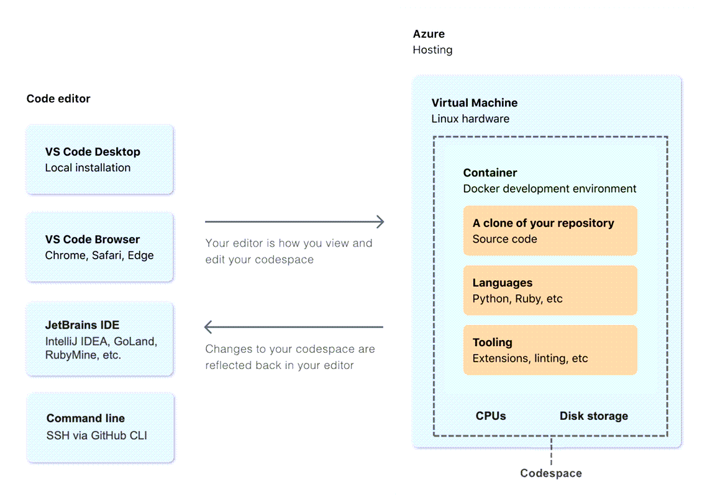
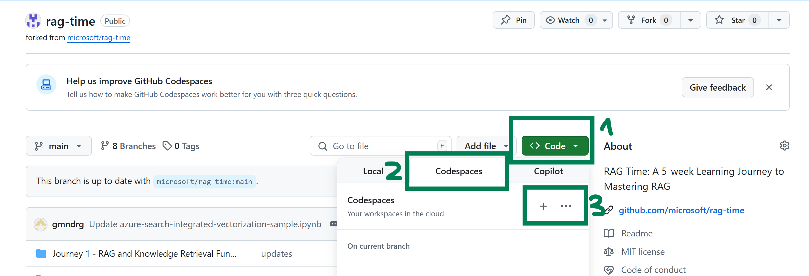
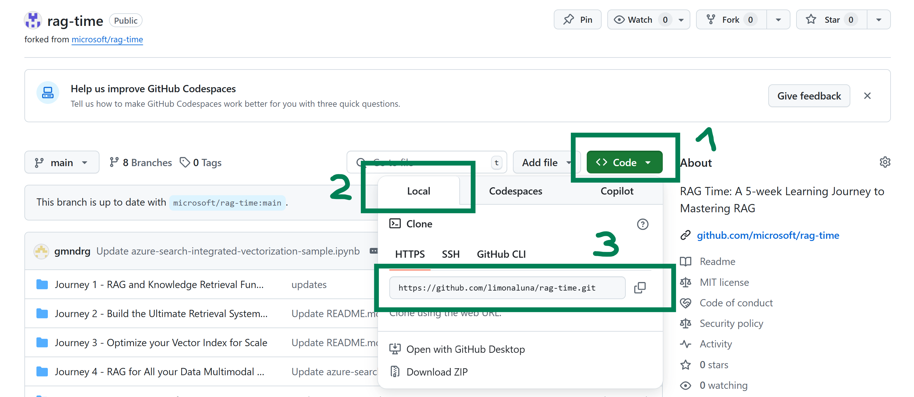

# Setup of Coding environment
There are several options how you can run this code. We are showcasing two approaches, one that is using Github Codespaces, and the other one to run locally on your machine using virtual environments

## Github Codespaces Setup
GitHub Codespaces is an instant, cloud-based development environment that uses a container to provide you with common languages, tools, and utilities for development.

When you create a GitHub Codespace, four processes occur:
1. A virtual machine and storage are assigned to your Codespace.
2. A container is created.
3. A connection to the Codespace is made.
4. A post-creation setup is made.



Github Codespaces can be used via your organization (if your company has enabled it),or from your personal account. Usage through the personal account is free for up to 60 hours per month. More details [here](https://docs.github.com/en/billing/managing-billing-for-your-products/managing-billing-for-github-codespaces/about-billing-for-github-codespaces).


### Prerequisites
To use GitHub Codespaces, you need:

- A personal GitHub account OR a Github Team/Enterprise account where Github Codespaces is enabled
- Access to GitHub Codespaces (included in GitHub Team, Enterprise, and some Individual plans)

### Launching a Codespace
1. Navigate to this repository on GitHub.
2. Click the green **"Code"** button at the top right.
3. Select the **"Codespaces"** tab.
4. Click **"Create codespace on `main`"** (or another branch you want to work from).

GitHub will automatically provision a development container based on the detected environment (e.g., Node.js, Python, .NET) and open it in your browser using VS Code Web.



### Inside the Codespace
- Ready-to-code environment with language-specific tools pre-installed
- Access to a full-featured terminal and Git
- Built-in port forwarding for local servers or apps
- VS Code extensions automatically suggested based on the project

### Saving Your Work
- Use Git inside the Codespace terminal or the **Source Control** tab to commit and push your changes back to the repo.
- Your changes are saved automatically when you commit.

### Stopping and Re-Starting a Codespace
You can stop a codespace at any time. When you stop a codespace, any running processes are stopped. Any saved changes in your codespace will still be available when you next start it. The terminal history is preserved, but the visible contents of the terminal window are not preserved between codespace sessions.

If you do not explicitly stop a codespace, it will continue to run until it times out from inactivity. Closing a codespace does not stop the codespace. For example, if you're using a codespace in the VS Code web client and you close the browser tab, the codespace remains running on the remote machine. For information about timeouts, see [Understanding the codespace lifecycle](https://docs.github.com/en/codespaces/about-codespaces/the-codespace-lifecycle#timeouts-for-github-codespaces).

### Delete your Codespace
Codespaces are automatically deleted after they have been stopped and have remained inactive for a defined number of days. The default retention period is 30 days.
however, at the end of the lab, it is recommended to delete your codespace to avoid running into codespace limitations or consuming too much of your free storage quota. 
More info in deleting your codespace is [here](https://docs.github.com/en/codespaces/developing-in-a-codespace/deleting-a-codespace)

## Local Setup
If you don't want to use Github Codespaces, you can use a Python Virtual Environment instead.
A Python virtual environment is an isolated space where you can install Python packages and dependencies specific to your project, without affecting your global Python setup or other projects.

It helps you:
- Avoid version conflicts between projects
- Keep your environment clean and reproducible
- Easily share dependencies via requirements.txt

### Clone the repository
1. Copy the repository URL (from Github)
2. Open Visual Studio Code
3. Press `Ctrl+Shift+P` (or `Cmd+Shift+P` on macOS) to open the **Command Palette**
4. Type and select `Git: Clone`
5. Paste the repository URL (e.g. "https://github.com/limonaluna/rag-time.git")
6. Choose a local folder where the repo will be cloned
7. When prompted, click **"Open"** to open the repo in VS Code



### Create virtual environment
#### 1. If you're not already in the folder where you want the environment:
```bash
cd /path/to/your/project
```

#### 2. Create virtual environment
```bash
python -m venv .venv
```

#### 3. Activate virtual environment
On macOS/Linux/WSL:
```bash
source .venv/bin/activate
```

On Windows CMD:
```cmd
.venv\Scripts\activate.bat
```

On Windows PowerShell:
```powershell
.venv\Scripts\Activate.ps1
```

### Install requirements
```bash
pip install -r requirements.txt
```

### Select the interpreter in VS Code
- Press Ctrl+Shift+P (or Cmd+Shift+P on macOS) to open the Command Palette
- Search for and select Python: Select Interpreter
- Choose the interpreter that points to .venv


# Setup of environment
## Fill out .env variables
- Create .env file (in the root of the repository)
- Example for .env file is shown in the file "env.example"
- Fill out all environment variables with the required information