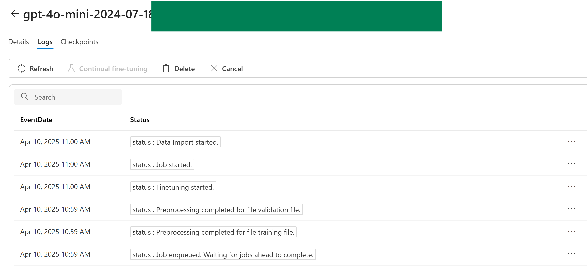

# LLM Fine-Tuning using Azure 
A fine-tuning guide for both OpenAI and Open-Source Large Lauguage Models on Azure. This repo. is designed to be user-friendly for people with non-technical background and for people with technical background such as Data Scientists and Machine Learning Engineers.

## What
Fine-Tuning, or *Supervised Fine-Tuning*, retrains an existing pre-trained LLM using example data, resulting in a new "custom" fine-tuned LLM that has been optimized for the provided task-specific examples. 

## Why
Typically, we use Fine-Tuning to:
- improve LLM performance on specific tasks.
- introduce information that wasn't well represented by the base LLM model.

Good use cases include: 
- steering the LLM outputs in a specific style or tone.
- too long or complex prompts to fit into the LLM prompt window.

## When
You may consider Fine-Tuning when:
- you have tried Prompt Engineering and RAG approaches.
- latency is critically important to the use case.
- high accuracy is required to meet the customer requirement.
- you have thousands of high-quality samples with ground-truth data.
- you have clear evaluation metrics to benchmark fine-tuned models.

# Hands-On Lab
## Fine-Tuning GPT Models - A Dashboard Experience
Learn how to fine-tune a GPT model using Azure OpenAI Studio - UI Dashboard.  

### Prerequisites
* Learn the [what, why, and when to use fine-tuning.](https://learn.microsoft.com/en-us/azure/ai-services/openai/concepts/fine-tuning-considerations)
* An Azure subscription.
* Access to Azure OpenAI Service.
* An Azure OpenAI resource created in the supported fine-tuning region (e.g. Sweden Central).
* GPT Models that support fine-tuning so far: [Fine-Tuning Models](https://learn.microsoft.com/en-us/azure/ai-services/openai/concepts/models?tabs=global-standard%2Cstandard-chat-completions#fine-tuning-models)

You can check the MS Learn document [here](https://learn.microsoft.com/en-us/azure/ai-services/openai/how-to/fine-tuning?tabs=turbo%2Cpython&pivots=programming-language-studio) for more details.

### Step 1: Choose a Dataset for Fine-Tuning
You have three options for preparing training and validation data for your fine-tuning experiment:

#### 1. Use the Public Sample Dataset (Clippy)

- **File Path**:  
  `06-LLM-Fine-Tuning\data\public-sample`
- **Note**: This dataset contains only 10 examples. While it's not suitable for producing high-quality fine-tuning results, it's a great starting point to understand the fine-tuning process and pipeline.

#### 2. Use the VW Technical Glossary Dataset

- **File Path**:  
  `06-LLM-Fine-Tuning\data\vw-technical-glossary\training_set_vw.jsonl`
- **Source**: Derived from the [Volkswagen Vans Technical Glossary](https://www.volkswagen-vans.co.uk/en/technology/technical-glossary.html)
- **Generation Method**: GPT-4o was used to create 100 high-quality questions based on glossary abbreviations.
- **Note**: This dataset is more suitable for fine-tuning than the Clippy example, though the sample size is still relatively limited.

#### 3. Create Your Own Custom Dataset

You may also choose to define your own use case and generate a custom training and validation dataset.

**Requirements:**
- Minimum of **50 high-quality samples** (preferably in the thousands for better results)
- Format must be **JSON Lines (JSONL)** with **UTF-8 encoding**

💡 *Tip: You can use an LLM to help you generate training examples. Provide it with your source material and prompt it to create a specific number of examples (in JSONL-format) tailored to your use case (e.g., Q&A, summarization, classification).*

- For your reference, a sample notebook has been created that reads the source data (JSON format) and uses GPT-4o to create a structured JSONL document with synthetic training data. Check it out here: 06-LLM-Fine-Tuning\06-Generate-Test-Data.ipynb

### Step 2: Open the *Create a custom model* wizard
1. Open Azure OpenAI Studio at [https://oai.azure.com/](https://oai.azure.com/) and sign in with credentials that have access to your Azure OpenAI resource. During the sign-in workflow, select the appropriate directory, Azure subscription, and Azure OpenAI resource.
2. In Azure Foundry, browse to the **Tools > Fine-Tuning** pane, and select **Fine-tune model**.

### Step 3: Select the *Base model*
The first step in creating a custom model is to choose a base model. 

The **Base model** pane lets you choose a base model to use for your custom model. Select the base model from the **Base model type** dropdown, and then select **Next** to continue.

### Step 4: Configure your *Fine-Tuning Method*
First, you need to choose the Fine-Tuning Method. We choose **Supervised** Method for this tutorial.

### Step 5: Upload your *Training Data*
The next step is to choose your training data either from the previously uploaded one or by uploading a new one. If you want to create your own training data, please note the following guidance on the required format of the training and validation data: [Guidance on data format](https://learn.microsoft.com/en-us/azure/ai-services/openai/how-to/fine-tuning?tabs=azure-openai&pivots=programming-language-studio#prepare-your-training-and-validation-data)

Select **Local file** to upload training data from a local file - the sample training data can be found in this repository under "06-LLM-Fine-Tuning/data/public-sample/training_set.jsonl"

### Step 6: Upload your *Validation Data*
You can choose your validation data by following the similar pattern as you upload your training data.

### Step 7 (Optional): Configure *Advanced options*
You can keep the **Default** values for the fine-tuning job, or adjust the **Hyperparameters** as desired.

#### Overview on the hyperparameters:
**Batch size**: is how many training examples you use in a single pass during training – trade off between speed & accuracy

**Learning Rate Multiplier**: multiplies the original learning rate used by the base model. Values > 1 increase the learning rate, < 1 decrease.

**Epochs**: determine the number of passes through the training data. Too few – underfit; too many – overfit

**Seed**: sets the random seed for your run – so you can get reproducible results! 

One can refer to the MS Learn document [here](https://learn.microsoft.com/en-us/azure/ai-services/openai/how-to/fine-tuning?tabs=turbo%2Cpython&pivots=programming-language-studio#configure-advanced-options) for a detailed explanation on key tun-able hyperparameters.

### Step 8: Review your choices, *Submit Training job* and check the *Status*
If you're ready to train your model, select **Submit** to start the fine-tuning job and return to the **Fine-Tuning** pane.

You can check the status of the fine-tuned model in the **Status** column of the **Fine-Tuning** tab.

After you start a fine-tuning job, it can take some time to complete (from minutes to hours). You can also dive deeper by reviewing the **Details**, **Logs**, and **Checkpoints** Tab after clicking on your fine-tune model training run.

* Fine Tuning Run Details:

* Fine Tuning Run Logs:

* Fine Tuning run Metrics:

### Step 9: Deploy a custom model
When the fine-tuning job succeeds, you can deploy the custom model from the **Fine-Tuning** pane to make it available for use with completion calls.

To deploy your fine-tuned model, select the custom model to deploy, and then select **Deploy**.

The **Deploy model** dialog box opens. 

In the dialog box, enter your **Deployment name** and then select **Deploy** to start the deployment of your custom model.

### Step 10: Test and use a deployed model
After your custom model deploys (Provisioning State = "Succeeded"), you can use it like any other deployed model. 

You can use the **Playgrounds** in [Azure OpenAI Studio]("https://oai.azure.com") to experiment with your new deployment. You can also use the fine-tuned model by calling the completion API.

Example: Compare the output of Base-Model to your fine-tuned model to a question specific to your fine-tuned data.

* Base Model Response:

* Fine-Tuned Model Response

⚠️ **Disclaimer**  
The sample datasets used in this fine-tuning tutorial are intentionally small and simplified for demonstration purposes. As a result, any performance comparisons between the fine-tuned model and the base model should be interpreted with caution. The limited data volume and domain coverage mean that observed improvements (or lack thereof) may not generalize to real-world scenarios. For meaningful fine-tuning results, larger and more representative datasets are recommended.

### Step 11 (Optional): Clean up your deployment resources
When you're done with your custom model, you can delete the deployment and model. You can also delete the training and validation files you uploaded to the service, if needed.

### Step 12 (Optional): Continous fine-tuning
Once you have created a fine-tuned model you may wish to continue to refine the model over time through further fine-tuning. Continuous fine-tuning is the iterative process of selecting an already fine-tuned model as a base model and fine-tuning it further on new sets of training examples.

To perform fine-tuning on a model that you have previously fine-tuned you would use the same process as described in **Step 1**, but instead of specifying the name of a generic base model, you would specify your already fine-tuned model. A custom fine-tuned model would look like <code>gpt-35-turbo-0613.ft-5fd1918ee65d4cd38a5dcf6835066ed7

